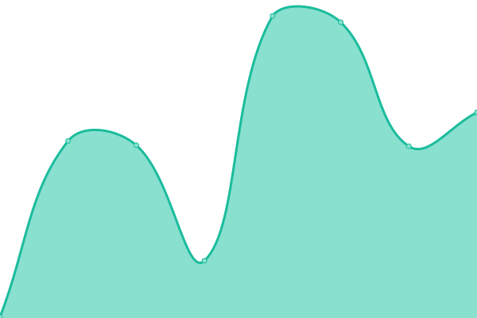

# [📈 Live Status](https://Krastanov.github.io/labservicesuptime): <!--live status--> **🟧 Partial outage**

This repository contains the open-source uptime monitor and status page for [Stefan Krastanov](http://blog.krastanov.org/), powered by [Upptime](https://github.com/upptime/upptime).

With [Upptime](https://upptime.js.org), you can get your own unlimited and free uptime monitor and status page, powered entirely by a GitHub repository. We use [Issues](https://github.com/Krastanov/labservicesuptime/issues) as incident reports, [Actions](https://github.com/Krastanov/labservicesuptime/actions) as uptime monitors, and [Pages](https://Krastanov.github.io/labservicesuptime) for the status page.

<!--start: status pages-->
<!-- This summary is generated by Upptime (https://github.com/upptime/upptime) -->
<!-- Do not edit this manually, your changes will be overwritten -->
<!-- prettier-ignore -->
| URL | Status | History | Response Time | Uptime |
| --- | ------ | ------- | ------------- | ------ |
|  [Blog](https://blog.krastanov.org) | 🟩 Up | [blog.yml](https://github.com/Krastanov/labservicesuptime/commits/HEAD/history/blog.yml) | 

 544ms
     
 | 

<a href="https://Krastanov.github.io/labservicesuptime/history/blog">100.00%</a>
    

|  [Lab website](https://lab.krastanov.org) | 🟩 Up | [lab-website.yml](https://github.com/Krastanov/labservicesuptime/commits/HEAD/history/lab-website.yml) | 

 196ms
     
 | 

<a href="https://Krastanov.github.io/labservicesuptime/history/lab-website">100.00%</a>
    

|  [Presentations](https://presentations.krastanov.org) | 🟥 Down | [presentations.yml](https://github.com/Krastanov/labservicesuptime/commits/HEAD/history/presentations.yml) | 

 0ms
     
 | 

<a href="https://Krastanov.github.io/labservicesuptime/history/presentations">8.14%</a>
    

|  [Jupyter](https://jupyter.krastanov.org) | 🟥 Down | [jupyter.yml](https://github.com/Krastanov/labservicesuptime/commits/HEAD/history/jupyter.yml) | 

 0ms
     
 | 

<a href="https://Krastanov.github.io/labservicesuptime/history/jupyter">8.14%</a>
    

|  [Pluto](https://pluto.krastanov.org) | 🟥 Down | [pluto.yml](https://github.com/Krastanov/labservicesuptime/commits/HEAD/history/pluto.yml) | 

 0ms
     
 | 

<a href="https://Krastanov.github.io/labservicesuptime/history/pluto">8.15%</a>
    

|  [MIT OQE](https://oqe.nonlocally.org) | 🟥 Down | [mit-oqe.yml](https://github.com/Krastanov/labservicesuptime/commits/HEAD/history/mit-oqe.yml) | 

 0ms
     
 | 

<a href="https://Krastanov.github.io/labservicesuptime/history/mit-oqe">8.16%</a>
    

|  [UMass QNet](https://umass-qnet.nonlocally.org) | 🟥 Down | [u-mass-q-net.yml](https://github.com/Krastanov/labservicesuptime/commits/HEAD/history/u-mass-q-net.yml) | 

 0ms
     
 | 

<a href="https://Krastanov.github.io/labservicesuptime/history/u-mass-q-net">8.16%</a>
    

|  [AreWeEntangledYet](https://areweentangledyet.com) | 🟥 Down | [are-we-entangled-yet.yml](https://github.com/Krastanov/labservicesuptime/commits/HEAD/history/are-we-entangled-yet.yml) | 

 0ms
     
 | 

<a href="https://Krastanov.github.io/labservicesuptime/history/are-we-entangled-yet">8.17%</a>
    

|  [Quantikz](https://quantikz.krastanov.org/) | 🟥 Down | [quantikz.yml](https://github.com/Krastanov/labservicesuptime/commits/HEAD/history/quantikz.yml) | 

 0ms
     
 | 

<a href="https://Krastanov.github.io/labservicesuptime/history/quantikz">8.17%</a>
    

<!--end: status pages-->

[**Visit our status website →**](https://Krastanov.github.io/labservicesuptime)

## 📄 License

- Powered by: [Upptime](https://github.com/upptime/upptime)
- Code: [MIT](./LICENSE) © [Stefan Krastanov](http://blog.krastanov.org/)
- Data in the `./history` directory: [Open Database License](https://opendatacommons.org/licenses/odbl/1-0/)
